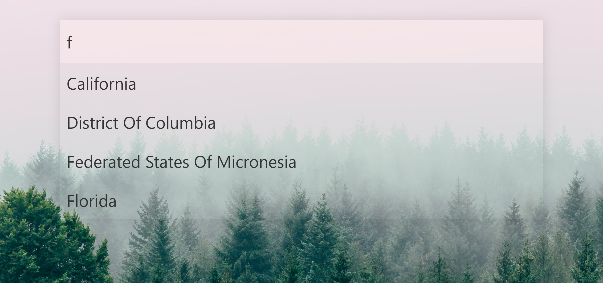

# About

The coolest searchbar for React.js! [Wow! Try](https://axmz.github.io/react-searchbar-awesome-page/)

</img>

# Install

```
npm i react-searchbar-awesome
```

# Use

<iframe
     src="https://codesandbox.io/embed/nameless-water-n88ve?fontsize=14&hidenavigation=1&theme=dark&view=preview"
     style="width:100%; height:500px; border:0; border-radius: 4px; overflow:hidden;"
     title="nameless-water-n88ve"
   ></iframe>

# How it can look like

<div>
  </img>
  </img>
  </img>
</div>
